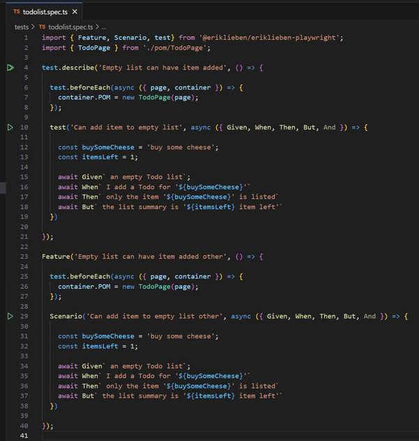
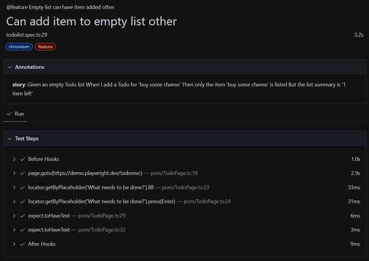

# Playwright Gherkin
Playwright fixtures to write gherkin style e2e tests with Playwright tooling support.
Adds your stories as story annotation to your tests.

## Demo
With [Playwright Test for VSCode](https://marketplace.visualstudio.com/items?itemName=ms-playwright.playwright):



Result in default HTML report viewer



## Usage
Create a Page Object Model and add use either the actions object or the more specific given, when, then objects to specify sentences. If your sentence is spit up by variables, use p0, p1, p2, p3, etc.

`pom/todopage.ts`
```typescript
import { expect, Page, Locator } from '@playwright/test';
import { PageObjectModel } from '@eriklieben/playwright-gherkin';

export class TodoPage extends PageObjectModel {
  readonly newTodo: Locator;
  readonly todoTitle: Locator;
  readonly todoCount: Locator;

  constructor(public readonly page: Page) {
    super();
    this.newTodo = page.getByPlaceholder('What needs to be done?');
    this.todoTitle = page.getByTestId('todo-title');
    this.todoCount = page.getByTestId('todo-count');
  }

  given = {
    'an empty Todo list': async () => {
      await this.page.goto('https://demo.playwright.dev/todomvc');
    },
  };
  when = {
    'I add a Todo for \'p0\'': async (item: string) => {
      await this.newTodo.fill(item);
      await this.newTodo.press('Enter');
    },
  };
  then = {
    'only the item \'p0\' is listed': async (item: string) => {
      await expect(this.todoTitle).toHaveText([item]);
    },
    'the list summary is \'p0 item left\'': async (item: string) => {
      await expect(this.todoCount).toHaveText(`${item} item left`);
    },
  }

  actions = {
    'only the item \'p0\' and \'p1\' are listed': async (item1: string, item2: string) => {
      await expect(this.todoTitle).toHaveText([item1, item2]);
    },
  };
}
```

In your tests: `todolist.spec.ts` use `test.beforeEach` to specify your POM (Page Object Model).
And now you can write your test in a syntax somewhat simular to Gherkin.

```typescript
import { Feature, Scenario, test} from '@eriklieben/playwright-gherkin';
import { TodoPage } from './TodoPage';

test.describe('Empty list can have item added', () => {

  test.beforeEach(async ({ page, container }) => {
    container.POM = new TodoPage(page);
  });

  test('Can add item to empty list', async ({ Given, When, Then, But, And }) => {

    const buySomeCheese = 'buy some cheese';
    const itemsLeft = 1;

    await Given` an empty Todo list`;
    await When` I add a Todo for '${buySomeCheese}'`
    await Then` only the item '${buySomeCheese}' is listed`
    await But` the list summary is '${itemsLeft} item left'`
  })
});
```

As an option, you can also use the following syntax, but this breaks the start all test for the `test.describe`/`Feature` in the vscode Playwright test runner plugin.

```typescript
import { Feature, Scenario, test} from '@eriklieben/playwright-gherkin';
import { TodoPage } from './TodoPage';

Feature('Empty list can have item added', () => {

    test.beforeEach(async ({ page, container }) => {
        container.POM = new TodoPage(page);
    });

    Scenario('Can add item to empty list', async ({ Given, When, Then, But, And }) => {

        const buySomeCheese = 'buy some cheese';
        const itemsLeft = 1;

        await Given` an empty Todo list`;
        await When` I add a Todo for '${buySomeCheese}'`
        await Then` only the item '${buySomeCheese}' is listed`
        await But` the list summary is '${itemsLeft} item left'`
    });
});
```
